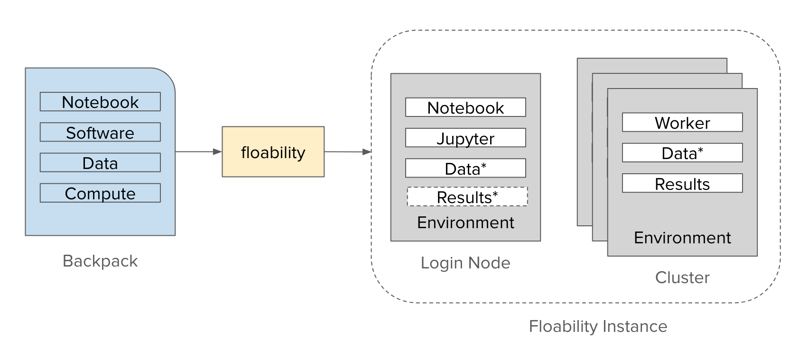

# Floability Backpack
A Floability "backpack" is a self-contained package that includes everything you need to run a Jupyter notebook at a large-scale computing facility. Think of it as your “all-in-one” kit—containing the notebook, required software, data, and compute specifications. (Everything you need for the day, including your lunch.) Once packed, `floability` can take this backpack and launch it as a running instance on an HPC cluster.

You can assemble a backpack manually if you already know all the components. Alternatively, you can let the tool `floability pack` (which leverages `sciunit`) analyze a notebook to determine what needs to be included.



## Packing a Floability Backpack
Scientists often begin writing their workflows locally on a laptop or desktop machine, starting with a small dataset. They add software dependencies incrementally as their analysis evolves. Once the workflow is complete, they want to run it on a large-scale HPC facility, where more computing resources are available.

To make this transition smooth, a Floability Backpack bundles four main components:

1. A Notebook (following Floability guidelines)
2. Software (and all dependencies)
3. Data (location, credentials, and integrity checks)
4. Compute (hardware requirements and credentials)

Below is an overview of each component and how they fit into your backpack.

### 1. Notebook
Your notebook should be the same one you developed locally, but it must follow certain Floability guidelines. Examples include:
- Avoid hardcoded manager names: Use environment variables (e.g., for TaskVine) instead of fixed strings.
- Data references: Instead of hardcoding paths, refer to data sources by the names defined in the backpack’s configuration files (e.g., data.yml)

After making these adjustments, place the finalized notebook file into the backpack.

### 2. Software
Your backpack should also include every piece of software needed to execute the notebook. These dependencies can come in various formats:

- Conda environment definition (environment.yml)
- Conda pack or Poncho pack (a .tar.gz file)
- Dockerfile or Apptainer definition
- Sciunit image

These artifacts may be created by the user or automatically generated via `floability pack`.

#### Example `envrionment.yml`
```yaml
name: my_mdv5_env

channels:
  - conda-forge

dependencies:
  - python=3.12
  - cloudpickle
  - ndcctools
  - coffea<2024.4.2
  - dask<2024.5.2
  - dask-awkward<2024.5.0
  - dask-core<2024.5.0
  - dask-histogram<2024.5.0
  - fsspec
  - pip:
    - fastjet<3.4.2.2
```

### 3. Data
Floability track all required data in data specification file (`data.yml`) file, which specifies how to retrieve, store, and verify each item. Every data component should include the following:
1. **Name:** A short identifier for the dataset (e.g. training_set, input_images).
2. **Source Type:**
    - URL: A link to download data (e.g. from an external server).
    - Filesystem Path: A path on a specific cluster (e.g. /data/crc_shared/experiment). If this path is unique to a particular host (e.g. crc.nd.edu), the notebook must only be run there.
    - Backpack Directory: Data stored directly within the backpack.
3. **Credentials:** Any tokens or login details needed to access the data.
4. **Verification:** Checksums, file sizes, or hashes to confirm the data is correct and unaltered.
5. **Target Location:** Where the data should appear in the notebook’s execution environment.

#### Example `data.yml`

```yaml
data:
  - name: capitol
    source_type: url
    source: https://ccl.cse.nd.edu/images/capitol.jpg
    url: https://ccl.cse.nd.edu/images/capitol.jpg
    target: capitol.jpg
  - name: "triggers"
    source_type: "backpack"
    source: "data/triggers.json"
    target_location: "data/triggers.json"
```

### 4. Compute
The compute specification (`compute.yml`) describes the HPC resources you want for running the notebook:

- Number of workers (e.g., Vine workers, Dask workers, etc.)
- CPUs per worker, memory, disk space
- Credential requirements (e.g., key locations or authentication tokens)

By providing a clear blueprint of desired resources, Floability can allocate the appropriate compute environment when launching your notebook.

#### Example `compute.yml`
```yaml
vine_factory_config:
  min-workers: 2
  max-workers: 4
  cores: 4
  memory: 1024
  disk: 2000
```

## Summary
Putting it all together, a Floability Backpack encapsulates:

1. The original Jupyter notebook—adapted to Floability guidelines.
2. All required software dependencies (Conda environments, Dockerfiles, etc.).
3. The necessary data files and a corresponding data specification.
4. A compute specification detailing the needed cluster resources.

With these pieces in one place, your workflow becomes easily transportable—from a laptop environment to a large-scale HPC cluster—while ensuring the notebook’s integrity and reproducibility. By letting floability unpack and run your backpack, you can confidently scale up your computations wherever the resources are available.